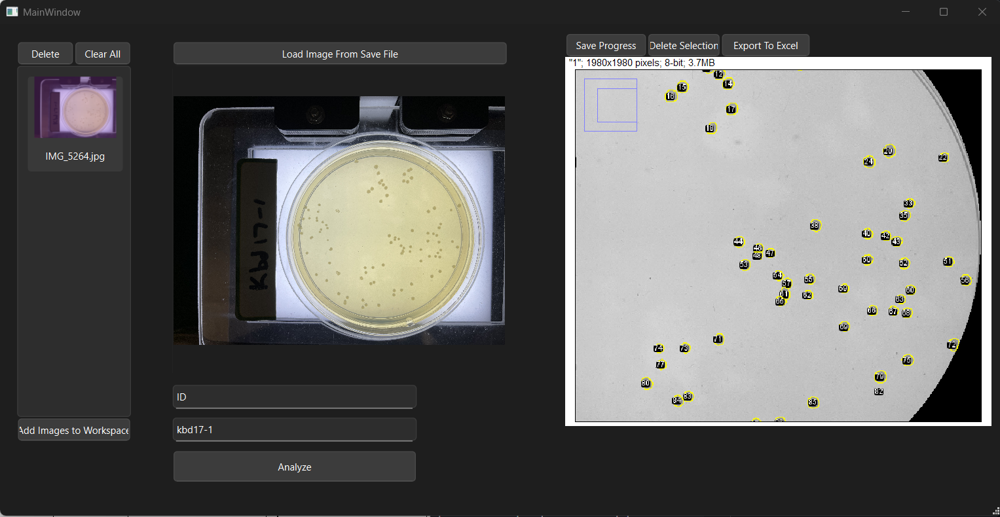

# Access and Usage

## Requirements (Included in Installation Script)

- Python 3 (tested with versions 3.9.0 through 3.13)
- OpenJDK 8 or 11
- Maven (must be available on the system PATH)

## Installation Instructions (Windows Only)

### 1. Check if Git is Installed

Open PowerShell (you can search for it) and type:

    git --version

If you see an error like "git is not recognized", download and install Git from:

    https://git-scm.com/downloads/win  
    Under "Download for Windows," click "Click here to download."  
    Once it installs, open it and click "Next" during the dialog.

To verify, reopen PowerShell and type:

    git --version

### 2. Clone the Repository

- On this page, click the green "Code" button in the top right.
- Copy the HTTPS link.

In PowerShell, type:

    cd Desktop

Clone the repository to your desktop by typing:

    git clone https://github.com/Andrewmh71/colony-capstone.git

### 3. Run the Setup Script

- Close the current PowerShell window.
- Reopen PowerShell **as Administrator** (search "PowerShell", right-click it, and select "Run as Administrator").

**Important:** When you run PowerShell as Administrator, it starts in the `C:\Windows\System32` directory.  
To get back to your user folder, type:
> **Note:** Replace `YOUR-NAME-HERE` with your actual Windows user account name.

    cd ..\..\Users\YOUR-NAME-HERE\Desktop\colony-capstone\src\ColonyCounter

Then, set the execution policy by typing:

    Set-ExecutionPolicy Unrestricted

Enter:

    A

Then, run the setup script:

    .\windows_dependencies.ps1

This will:
- Install Java, Python, and Maven
- Set environment variables
- Install required Python packages

**Note:** This step may take several minutes, don't close powershell until the window until the prompt says "All done".

### 4. Launch the Application

- Close PowerShell.
- Reopen PowerShell **as Administrator** again.
- Navigate back to the same folder (repeat the steps above if needed):
> **Reminder:** Replace `YOUR-NAME-HERE` with your actual Windows user account name.

    cd ..\..\Users\YOUR-NAME-HERE\Desktop\colony-capstone\src\ColonyCounter

Start the app:

    python mainwindow.py

It may take up to a minute to launch the first time.

### Low-Cost Bacterial Colony Processing System

An accessible, open-source alternative to expensive commercial colony counting tools.

Team Members

    Luke Ellister
    Andrew Hister
    Timmy Le
    Jose Navarro

Project Timeline / Status

    Currently in advanced development.
    Core features are functional and ready for testing and refinement.

Value Proposition

Problem Statement

    Accurately analyzing and counting bacterial colonies is a fundamental task in microbiological research.
    However, balancing precision and efficiency presents significant challenges.

Existing Methods

    Manual Counting
        Advantages: No additional equipment or software required
        Drawbacks: Time-consuming, labor-intensive, and diverts focus from data analysis

    Automated Counting Systems
        Advantages: Fast, consistent, and precise
        Drawbacks: Require expensive hardware and complex proprietary software

The Dilemma

    Biologists face two difficult options:
        1. Invest thousands of dollars in commercial automated systems
        2. Rely on manual methods, sacrificing time and productivity

Our Solution

    This project bridges the gap by offering an accessible, accurate, and user-friendly image analysis tool
    that provides the benefits of automation—without the financial or technical burden.

Target Audience

    Microbiology researchers and laboratory technicians seeking a cost-effective colony analysis solution.

Core Features and Benefits

    Free and Open Source
        No licensing costs. Ideal for research labs with limited budgets.

    Simple, One-Click Workflow
        Designed for ease of use. A core analysis task can be completed with a single click.
        No advanced technical knowledge required.

    Manual Editing Support
        Users can manually add or delete colonies. This is essential for cases involving:
            Thick-rimmed Petri dishes
            Poor lighting
            Noisy or low-contrast images
        This hybrid approach ensures accurate results across a variety of conditions.

Comparison with Existing Solutions

    Commercial systems may offer similar accuracy but come with high costs and proprietary constraints.
    This tool achieves comparable functionality without expensive hardware or complex licensing models.

Technical Implementation

    Frontend / UI
        Developed using PyQt6.
        Users can upload images, view thumbnails, and open dedicated analysis windows.
        The interface supports efficient image management and review.

    Backend / Image Processing
        Petri dish isolation is performed using OpenCV.
        Images are then passed to ImageJ (via PyImageJ) for particle analysis and ROI management.

    File Management
        Images are saved to disk to preserve workspace continuity.
        Processed images and ROI data can be saved and exported to maintain analysis history.

Data Flow

    1. Image is uploaded and saved to disk
    2. Thumbnail appears in the main UI
    3. Clicking the thumbnail opens an analysis window
    4. Existing ROI data is loaded if present; otherwise, analysis is performed
    5. OpenCV identifies the Petri dish
    6. ImageJ detects colonies using particle analysis
    7. ROIs can be saved or updated, and results exported as CSV files

Development Challenges and Solutions

    Petri Dish Detection Performance
        Initial implementation using OpenCV's Hough Circle Transform was inefficient with high-resolution images.
        This caused long processing times and false detections.

        Solution:
            The image is downscaled to 1% of its original size before detection.
            Coordinates are scaled back to match the original image.
            The center-most circle is selected, assuming the dish is centered.
            This significantly improved both performance and accuracy.

    ImageJ GUI Integration
        The default ImageJ GUI opened separate windows, creating a disjointed experience.

        Solution:
            ImageJ is now embedded directly into the PyQt interface.
            This improves workflow consistency and user experience.

The Graphical User Interace

Add images to workspace:  Upload one or more files

Delete selected image:  Remove selected file and saved data

Analyze:  Start from scratch and analyze the image

Load image from saved file:  Load an image that has already been saved with progress to continue work

Update changes:  Update the manual changes made that are unsaved (insertions/deletions)

Save changes:  Save your updated changes to file

Export to Excel:  Save data as CSV

Contact Information

    Andrew Hister  
        Email: hisera@oregonstate.edu  
        Phone: (503) 828-4461

    Jose Navarro  
        Email: navarrjo@oregonstate.edu  
        Phone: (503) 602-8891

    Timmy Le  
        Email: letimm@oregonstate.edu  
        Phone: (503) 734-6018

    Luke Ellister  
        Email: luke@hobonanikin.com  
        Phone: (541) 968-5465
